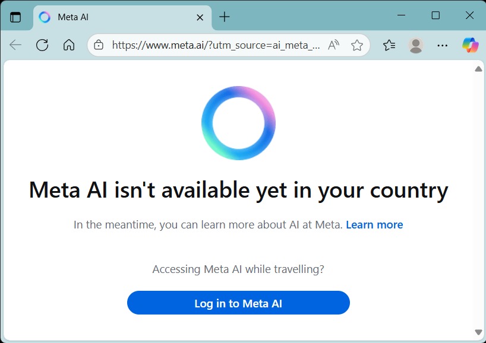

# metaai 🛟
metaai : Meta AI App # formerly Meta View # Llama 4


## Meta AI



## Notes
```
Malaysia is still not supported for many of these advanced features, according to user reports from early 2025.
The availability of Meta AI is currently restricted to countries such as the United States, Australia, Canada, and several others, primarily due to varying regulatory environments.
One of the most significant barriers is the European Union's stringent data protection and AI regulations, which have yet to approve the deployment of Meta’s AI technologies.
```


## Coming Soon ...


